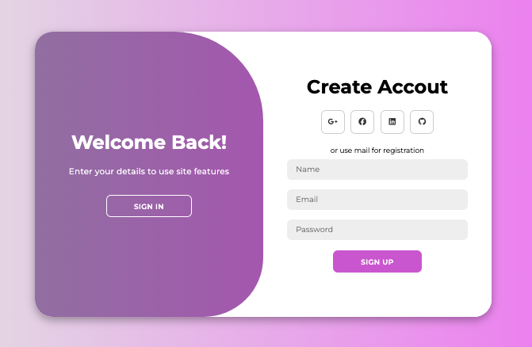
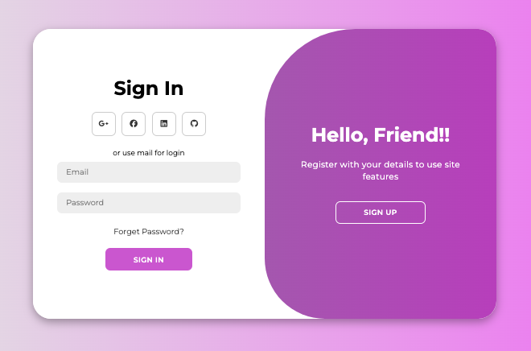

# 1. Simple Calculator

This is a simple calculator built using HTML, CSS, and JavaScript. It supports basic arithmetic operations like addition, subtraction, multiplication, and division. The project demonstrates DOM manipulation and basic event handling in JavaScript.

## Features:
- Addition, subtraction, multiplication, division.
- Clear and delete functionality.


### Screenshot:


# 2. Animated Login and Signup Page

A fully responsive and modern login/signup page created using HTML, CSS, and JavaScript. This project features animations using CSS transitions and keyframes, providing a smooth and dynamic user experience. The login and signup forms toggle seamlessly, creating a visually engaging interaction.

## Features
- **Responsive Layout**: Designed using CSS Flexbox to ensure the layout adapts to different screen sizes.
- **Animations**: Implemented using CSS transitions and keyframes to create fluid animations.
- **Interactive Form Switching**: JavaScript toggles between login and signup forms with smooth transitions.
- **Modern UI/UX Design**: Clean and minimalistic design with engaging animation effects.

## Screenshots

### Sign Up Page


### Login Page



## Technologies Used
- **HTML5**
- **CSS3 (Flexbox, Transitions, Keyframes)**
- **JavaScript (Form Toggling Logic)**

# 3. Tic Tac Toe Game

A simple Tic Tac Toe game built with HTML, CSS, and JavaScript. This project allows two players to take turns and play the classic 3x3 grid game in the browser.

## Features
- 2-player gameplay with alternating turns (X and O).
- Win detection and display of winner or draw.
- Responsive design for different screen sizes.
- Ability to reset and play again without refreshing the page.

## Technologies Used
- **HTML5**: For structuring the game layout.
- **CSS3**: For styling the board and responsive design.
- **JavaScript (ES6+)**: To handle game logic, player turns, and win/draw conditions.

### Player Wins! 


### Gamw Draw!


## How to Run
1. Clone the repository:
   ```bash
   git clone https://github.com/SayaliBhosale16/JS-Playground.git
