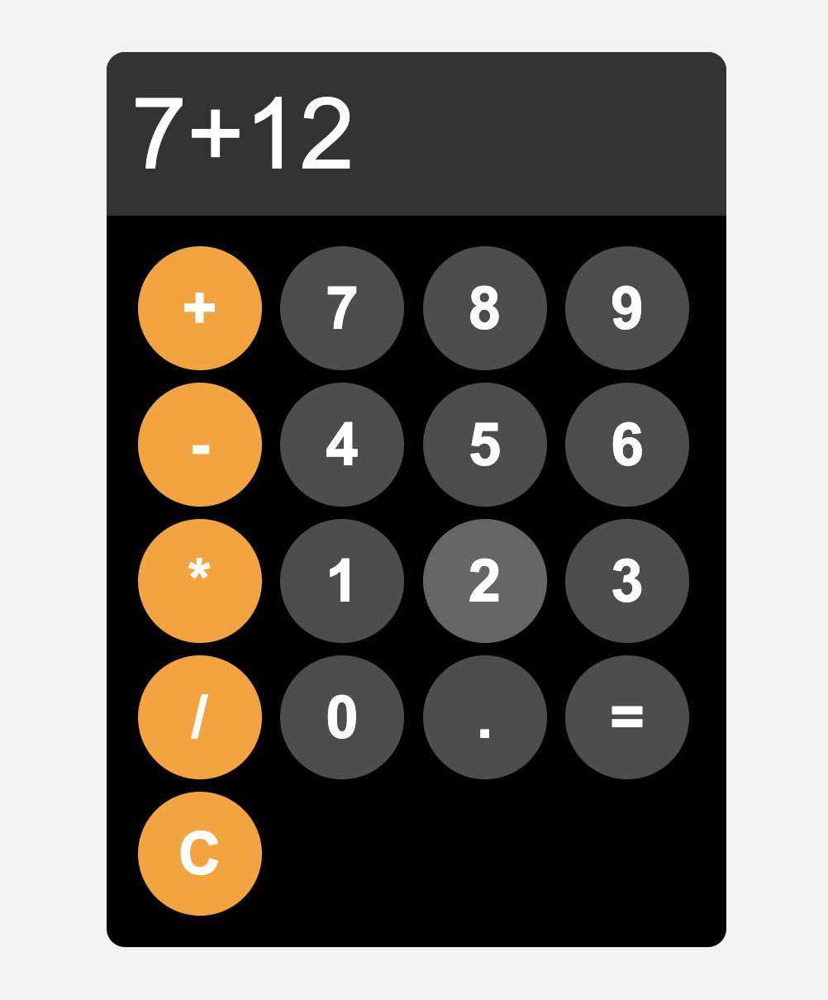

# 1. Simple Calculator

This is a simple calculator built using HTML, CSS, and JavaScript. It supports basic arithmetic operations like addition, subtraction, multiplication, and division. The project demonstrates DOM manipulation and basic event handling in JavaScript.

## Features:
- Addition, subtraction, multiplication, division.
- Clear and delete functionality.

### Screenshot:

Try it out and explore how the logic for basic operations is implemented in JavaScript!
